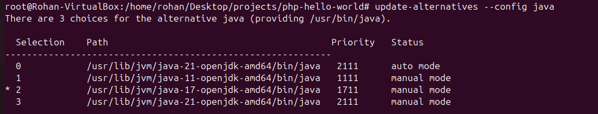
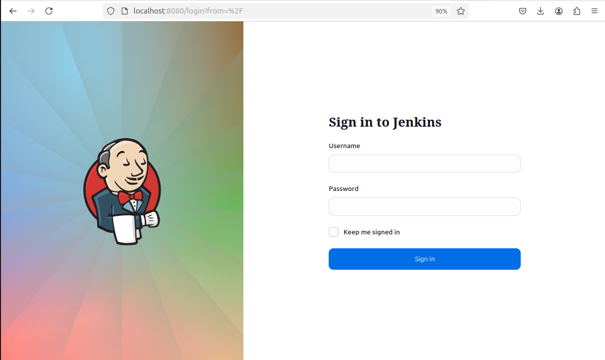
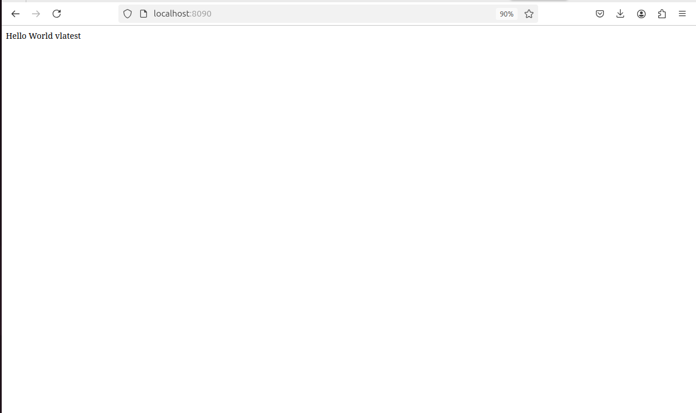

# Dev-ops internship challenge

# Overview
This is a project provided by intuji for internship for devops where you have to create and deploy an app with deployment tool like docker and Jenkins which helps in Continuos Integration and Continuous Deployment.

# Steps:

## 1. Fork or clone the github repo from the link.

## 2. Writing a bash script to install Docker
    This step was a little complex because I had to learn how to write a proper bash script.

### Summary of the script:
• Update the package
• Installing prerequisites like certificates and such
• Adding docker's official gpg keys
• Set up a docker repo
• Update packages again
• Install docker and start docker
• Check docker version

## 3. Creating a dockerfile

Brief Description:
The from command
COPY command copies the current contents to /var/www/html/ which is a directory inside the apache2 folder
CMD will run the command inside the brackets when the dockerfile is started

## 4. Creating an Docker image

After creating an image, you can create a docker-compose file

## 5. Creating a docker-compose file

Brief Description:
version denotes the version of the docker
services are where everything we need are written and docker compose are indentation sensitive
services can be named anything
image denote which image to use but in this code, we are using the image named intuji which we will build locally
ports are where the web-app would run, which in this case is 8090
container_name will provide a custom name for our container

the command used is: docker-compose up to run the docker-compose.yml file

After running the command you can check your web-app on your localhost on the specified port number which is 8090 for us.

## 6. Creating an account at Docker hub

Docker hub somewhat works like github. It is where we push our created images.

## 7. Pushing an image into Dockerhub:

After creating an image there are some steps we must follow before pushing an image:

Step 1: Tag an image {docker tag image_name docker_hub_user_name}/{local_image_name}
Step 2: Push the image {docker push username/image_name}

As you can see, the image has recently been pushed.

## 8. Installing Jenkins

To install Jenkins, you can view the commands on the official Jenkins docs page.
https://www.jenkins.io/doc/book/installing/linux/

## 9. Setting an environment for Jenkins

Since ubuntu in default had the latest version of open jdk, we had to install open jdk version 17.

As you can see openjdk 17 has been selected as default so jenkins can run.

After setting up the environment, you can use systemctl start jenkins to start jenkins and systemctl status to check whether the Jenkins is running or not.

Jenkins by default uses port 8080 in your localhost.

## 10. Building a freestyle project on Jenkins

## 11. Configuring Jenkins

For the source code, you can insert the link to your github repo code that you want to develop and as for building environment, you can insert your credentials to gain access to your dockerhub account. If your project is privated on github then you will need to insert credentials for github as well.

As you can see the github account has been connected to jenkins.

## 12. Running the web-app from Jenkins

In the Jenkins, add an execute shell and create a image like you would in a terminal.

The username and password is to my dockerhub so a I have changed it currently.

As you can see the web-app is up and running.

## 13. Creating changes into index.php 

After creating some changes into index, i then pushed it into my git directory.

Build 7 was where the succesful Jenkins host was finally created while build 8 and 9 were to see if changes were applied.

As you can see the changes have been applied.

# Challenges faced:
Although the most of the task was easy, the hardest challenge was learning Jenkins as most of the sources and videos available on youtube were really old.

I had created 2 freestyle projects and above 50 build to finally deploy a succesful web app from jenkins.
